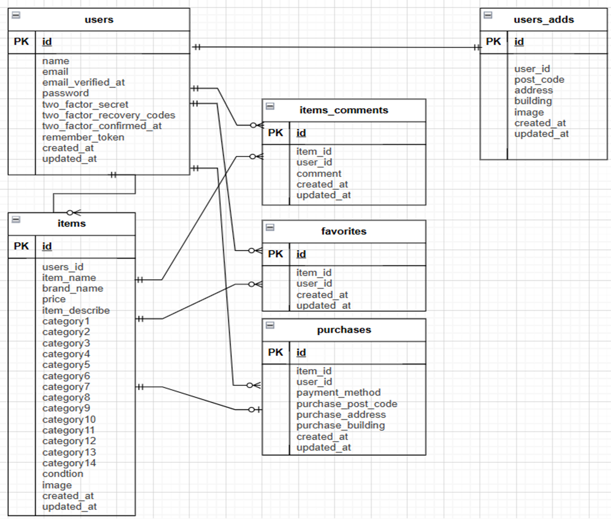

# アプリケーション名

フリマアプリケーション

## 環境構築

- Docker テンプレートのクローン
  $ git clone git@github.com:MemorialAddress/shop.git

- Docker コンテナの作成(shop ディレクトリにて実行)
  $ docker-compose up -d --build

- Laravel パッケージのインストール
  $ docker-compose exec php bash
  ＃ composer install

- 環境定義ファイル作成
  $ cp .env.example .env

- .env ファイルの以下項目を変更
  DB_HOST=127.0.0.1 → DB_HOST=mysql
  DB_DATABASE=laravel → DB_DATABASE=laravel_db
  DB_USERNAME=root → DB_USERNAME=laravel_user
  DB_PASSWORD= → DB_PASSWORD=laravel_pass
  MAIL_FROM_ADDRESS=null → MAIL_FROM_ADDRESS=no-reply@example.com

- .env ファイルの以下項目を追加
  STRIPE_KEY="pk_test_51SWUXWCIWlRk5w6j3jPXidlUy8ELxXq6NlGoHwqLXnpIQTzvQqfuNL8oD7EPaYbw4YSpA9tRoJBqiE0BO2YrhrLt001eiHPzas"
  STRIPE_SECRET=「基本設計書（生徒様入力用）」に記載の文字列を転記
  STRIPE_WEBHOOK_SECRET=「基本設計書（生徒様入力用）」に記載を転記

- 暗号鍵採番
  $ docker-compose exec php bash
  ＃ php artisan key:generate

- テーブルマイグレーション、シーディング
  ＃ php artisan migrate
  ＃ php artisan db:seed

- シンボリックリンク設定
  ＃ php artisan storage:link

- Stripe 決済使用時は以下コマンドでコンテナ起動すること
  $ docker run -it --rm --network host \
   -v $PWD:/workspace -w /workspace \
   stripe/stripe-cli listen \
   --forward-to http://host.docker.internal/webhook \
   --api-key 「基本設計書（生徒様入力用）」に記載の文字列を転記(ダブルコーテーション不要)

## テストユーザー

・メールアドレス：test1@example.com パスワード：password
・メールアドレス：test2@example.com パスワード：password
・メールアドレス：test3@example.com パスワード：password

## ER 図

